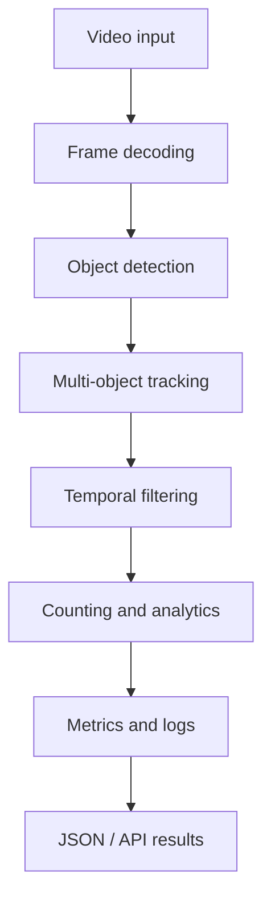

# Production Video Analytics

A production-oriented computer vision portfolio project for turning raw video into reliable detections, tracks, counts, operational metrics, and machine-readable results.

> **Status:** Foundation phase. The architecture, software contracts, configuration, and benchmark plan are in place. Model integration and reproducible benchmarks are the next milestones.

## Why this project exists

A model demo is not the same as a dependable video analytics system. Real deployments must handle difficult lighting, small objects, occlusion, motion blur, identity switches, long videos, GPU limits, failure recovery, and measurable processing cost.

This project is being built to demonstrate the full path from computer vision inference to an observable production pipeline.

## Target use cases

- Object detection, segmentation, tracking, and counting
- High-resolution and long-form video processing
- Safety, retail, traffic, agriculture, and industrial analytics
- Offline batch inference with future API and cloud deployment support
- Evidence-based evaluation of accuracy, speed, stability, and cost

## Architecture



See [the architecture document](docs/architecture.md) for component boundaries, reliability principles, and the planned production path.

## Repository structure

```text
production-video-analytics/
├── README.md
├── requirements.txt
├── configs/
│   └── default.yaml
├── docs/
│   └── architecture.md
├── examples/
│   └── README.md
└── src/
    ├── __init__.py
    ├── detection.py
    ├── tracking.py
    ├── video_pipeline.py
    └── metrics.py
```

## Benchmark plan

Every benchmark will record the exact model, video, hardware, resolution, thresholds, and software version so results can be reproduced.

| Area | Metric | Status |
|---|---|---|
| Throughput | Frames per second | Planned |
| Latency | Decode, inference, tracking, end-to-end | Planned |
| Detection | Precision, recall, false positives, missed detections | Planned |
| Tracking | ID switches, fragmentation, track continuity | Planned |
| Resources | GPU memory, CPU memory, utilization | Planned |
| Cost | Estimated compute cost per video hour | Planned |

No benchmark numbers will be published without a reproducible experiment.

## Engineering principles

- **Measure before optimizing:** profile decode, inference, tracking, and serialization separately.
- **Recall failures must be visible:** save false-negative and low-confidence examples for review.
- **Temporal evidence matters:** use tracking and neighboring frames rather than isolated detections alone.
- **Configuration over hard-coding:** keep thresholds and runtime choices in versioned configuration.
- **Privacy by design:** do not commit customer footage, faces, plates, credentials, or proprietary data.
- **Honest status:** distinguish working features, experiments, and planned work.

## Roadmap

- [x] Define architecture and repository foundation
- [x] Add typed detection and tracking contracts
- [x] Add configuration and metrics foundation
- [ ] Integrate a public pretrained YOLO model
- [ ] Add ByteTrack or BoT-SORT adapter
- [ ] Add temporal filtering and line/zone counting
- [ ] Produce JSON/CSV results and annotated video
- [ ] Add tests and a reproducible public example
- [ ] Benchmark CPU/GPU throughput and cost per video hour
- [ ] Add FastAPI, Docker, monitoring, and deployment guidance

## Data and confidentiality

This repository uses only public, licensed, or synthetic examples. It does not contain employer code, private datasets, customer information, credentials, model weights, or internal infrastructure details.

## License

Released under the [MIT License](LICENSE).

---

Built by [Md. Asadozzaman](https://github.com/asadozzaman), Senior AI Engineer focused on Computer Vision and production AI systems.
