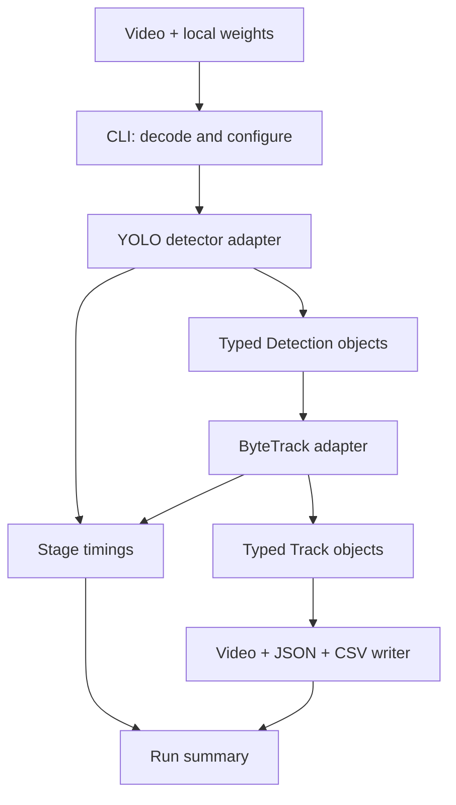

# Production Video Analytics

**YOLO detection · ByteTrack tracking · Inspectable run artifacts**

[](https://github.com/asadozzaman/production-video-analytics/actions/workflows/ci.yml)

A Python video pipeline that keeps detection, tracking, timing, and result serialization behind clear interfaces. Process a video into an annotated MP4, per-frame JSON, track-observation CSV, and an effective-configuration summary.

**Current status:** working detection/tracking baseline with recorded CPU runs. Counting, formal accuracy evaluation, API deployment, and GPU comparisons are upcoming milestones.

[Recorded experiment](docs/phase1_baseline.md) · [Architecture decisions](docs/architecture.md) · [Tests](tests)

## Recorded result

The [Step 5 functional run](docs/phase1_baseline.md#step-5--machine-readable-run-results) processed all **393 frames** of a 1920 × 1080, 25 FPS video using YOLO26n at inference size 640 on CPU.

| Measurement | Recorded value |
| --- | ---: |
| End-to-end processing throughput | 14.89 frames/s |
| Detection-stage throughput | 22.58 frames/s |
| Mean detection latency | 44.28 ms/frame |
| Mean tracking latency | 1.24 ms/frame |
| Wall time | 26.39 s |
| Track observations / distinct track IDs | 1,761 / 42 |

Settings: confidence **0.25**, NMS IoU **0.45**, ByteTrack settings in [`configs/default.yaml`](configs/default.yaml). The recorded environment was Python 3.10.10, Ultralytics 8.4.171, and PyTorch 2.14.1+cpu.

These are recorded functional results, not a controlled hardware benchmark. The CPU model and redistributable source-video reference are not recorded, so exact performance reproduction is incomplete. The 42 IDs are **not a ground-truth object count**. Detection accuracy, tracking accuracy, ID switches, memory use, and cost have not been measured. The source video's 25 FPS is its playback rate, not processing speed.

## Run on your video

Use Python 3.10+ in a virtual environment:

```bash
git clone https://github.com/asadozzaman/production-video-analytics.git
cd production-video-analytics
python -m venv .venv
# Linux/macOS: source .venv/bin/activate
# Windows PowerShell: .venv\Scripts\Activate.ps1
python -m pip install -r requirements.txt
```

Provide a local video and compatible YOLO weights that you are entitled to use. Both must already exist; the runner does not download them.

```bash
python -m src.run_video --source path/to/video.mp4 --model path/to/model.pt --output-dir outputs/demo --device cpu --conf 0.25 --iou 0.45 --imgsz 640 --tracker bytetrack
```

Use `--device auto` for Ultralytics device selection, `--device 0` for a CUDA device, or `--tracker none` for detection only. The **CLI tracker default is `none`**. Choose a new output directory for each run; existing directories are rejected.

| Output | Contents |
| --- | --- |
| `annotated.mp4` | Boxes, class labels, confidence, and active track IDs |
| `frames.json` | Sequential frame indices, timestamps, detections, and tracks |
| `tracks.csv` | One row per active track observation |
| `summary.json` | Effective configuration, environment, counts, and stage timings |

## Implemented architecture


```mermaid
flowchart TD
    V["Video + local weights"] --> R["CLI: decode and configure"]
    R --> D["YOLO detector adapter"]
    D --> P["Typed Detection objects"]
    P --> T["ByteTrack adapter"]
    T --> O["Typed Track objects"]
    O --> W["Video + JSON + CSV writer"]
    D --> M["Stage timings"]
    T --> M
    M --> S["Run summary"]
    W --> S
```

The detector calls model inference; the tracker consumes converted detection objects. Serialization lives outside both adapters. For `--output-dir`, results stream into a temporary directory and are published after completion. The legacy `--output` mode uses the summary as its completion marker; see the [artifact contract](docs/phase1_baseline.md#step-5--machine-readable-run-results).

## Engineering decisions worth inspecting

- **Stable interfaces:** [`Detection`](src/detection.py) and [`Track`](src/tracking.py) separate the application from model-library outputs.
- **Transparent association:** [`ByteTrackAdapter`](src/trackers/bytetrack.py) makes threshold mapping explicit. At confidence 0.25, detections below 0.25 cannot reach the tracker's 0.1 low threshold.
- **Bounded output memory:** [`results.py`](src/results.py) streams frame and CSV records rather than accumulating decoded images.
- **Traceable runs:** [`run_video.py`](src/run_video.py) records effective CLI/YAML settings and distinguishes stage throughput from wall-time throughput.

Some configuration fields describe planned behavior. Temporal filtering, counting, warmup exclusion, resource measurement, and cost estimation are not implemented merely because related keys appear in the YAML file.

## Automated checks

```bash
python -m unittest discover -s tests -v
python -m compileall -q src tests
```

CI runs the existing deterministic adapter and serialization tests on CPU, plus a CLI import/help smoke check. It does not download model weights, run the traffic experiment, or measure detection/tracking accuracy.

## Next milestones

- [x] YOLO adapter and typed detection contract
- [x] ByteTrack integration and identity/reset tests
- [x] Annotated video, streaming JSON/CSV, and run summary
- [x] Recorded CPU functional runs and artifact consistency checks
- [ ] Redistributable sample video with provenance and input checksum
- [ ] Human-verified ground truth and tracking/counting evaluation
- [ ] Temporal filtering and line/zone counting
- [ ] Controlled CPU/GPU comparisons with full hardware metadata
- [ ] FastAPI, Docker, durable jobs, monitoring, and deployment

## Data and license

Do not commit employer code, customer footage, credentials, or proprietary weights. Supply public, licensed, or synthetic inputs for demonstrations. Repository code is under the [MIT License](LICENSE); dependencies, model weights, and input media retain their own terms.

Built by [Md. Asadozzaman](https://github.com/asadozzaman), Senior AI Engineer focused on Computer Vision and production AI systems.
