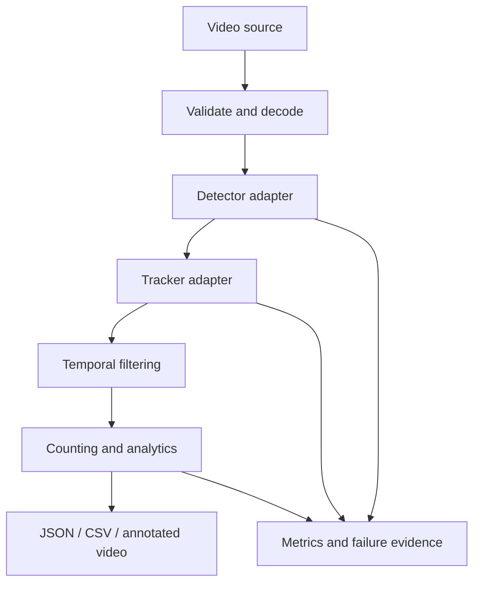

# Architecture

## Objective

Convert video into reliable, auditable analytics while keeping model inference, tracking, business logic, and infrastructure independently replaceable.

## Component responsibilities

| Component | Responsibility | Primary failure signals |
|---|---|---|
| Input and decoding | Validate media and produce timestamped frames | Decode errors, corrupt frames, incorrect FPS |
| Detection | Locate and classify objects | False negatives, false positives, poor calibration |
| Tracking | Maintain identities through time | ID switches, fragmentation, lost tracks |
| Temporal filtering | Combine neighboring-frame evidence | Flicker, short false tracks, missed recovery |
| Analytics | Count events and aggregate measurements | Double counts, rule errors, zone mistakes |
| Output | Produce JSON/CSV/video artifacts | Schema errors, partial writes, missing evidence |
| Observability | Record latency, resources, accuracy, and cost | Silent degradation and untraceable failures |

## Data flow

## Design decisions

### Stable domain contracts

The pipeline consumes `Detection` and `Track` objects instead of depending directly on a model library's result objects. This makes it possible to compare YOLO versions, exported runtimes, and trackers without rewriting analytics logic.

### Stage-level measurement

Decode, detection, tracking, analytics, and serialization will be measured independently. A single end-to-end FPS number is not enough to diagnose a slow or expensive system.

### Temporal evidence

Video contains repeated observations of the same object. Tracking and temporal propagation can recover detections that are uncertain in isolated frames, but this must be evaluated carefully because propagation can also extend false positives.

### Explicit failure analysis

Evaluation must retain representative misses, false positives, ID switches, and fragmented tracks. Aggregate metrics alone do not explain whether the system is safe for a real use case.

## Planned production path

1. Local reproducible baseline on public data
2. Detector and tracker comparison
3. Temporal filtering and domain analytics
4. Automated tests and benchmark reports
5. FastAPI interface and background jobs
6. Docker image with CPU/GPU profiles
7. Object storage, result persistence, retries, and idempotency
8. Monitoring for throughput, failures, resource use, and drift
9. Cost-per-video-hour reporting

## Security and privacy

- Never commit credentials, customer data, private footage, or proprietary weights.
- Validate file types, paths, and output destinations.
- Treat uploaded video and generated evidence frames as sensitive.
- Define retention and access controls before cloud deployment.
- Pin and scan dependencies before publishing a deployable image.
